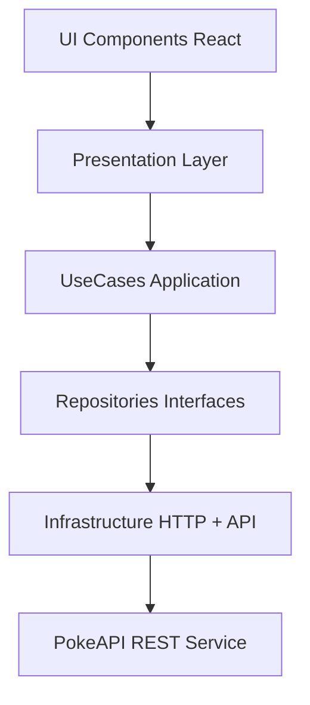
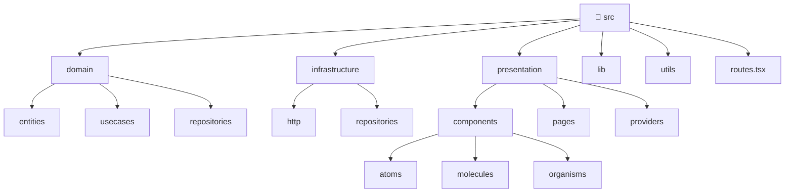
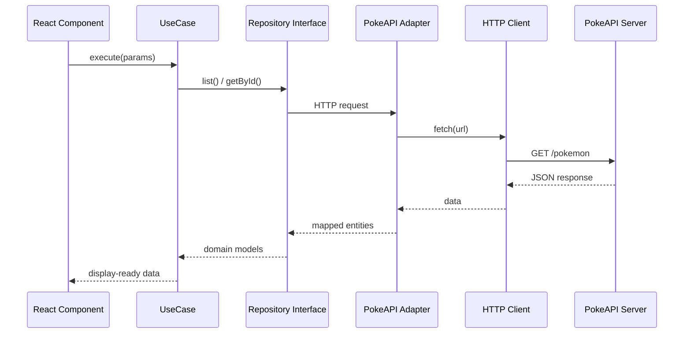
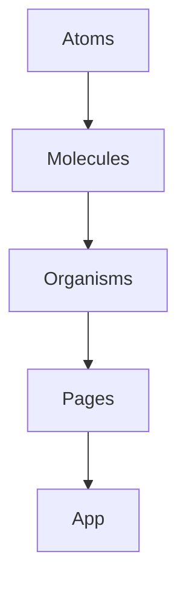

# 🧪 Pokémon Browser – Clean Architecture (React + TypeScript)

A responsive Pokémon browser built with **React 19 + TypeScript + Tailwind CSS**, following **Clean Architecture** and **Atomic Design** principles.  
Deployed easily via **Vercel**, **Netlify**, or **Cloudflare Pages**.

live demo: https://pokedex-mocha-nine-42.vercel.app/

---

## 🧭 Overview

Users can:
- View Pokémon in two modes:
  - **Pagination** (page numbers + next/previous)
  - **Load More** (infinite scroll style)
- View a **detailed page** for each Pokémon:
  - Name, sprite, stats, types, height, weight, base experience, and abilities
- Enjoy a **responsive**, clean, and testable architecture.

---

## 🧱 Architecture Overview



- Presentation (React) → contains components built using Atomic Design.
- Domain → pure business logic: entities, use cases, repository contracts.
- Infrastructure → implements repositories using HTTP + PokeAPI.
- Data Flow is unidirectional and easily testable.

## 🗂️ Folder Structure



## 🔄 Data Flow

## 🎨 UI Design Highlights

- Responsive grid for Pokémon cards (2 → 6 columns)
- Gradient header for details
- Stats visualized as progress bars
- Type chips with colored badges
- Modern soft background gradients per view:
    - /pagination → bg-[#E5EAFE]
    - /load-more → bg-[#DEFAEB]
 
## 🧩 Atomic Design Breakdown


## 🚀 Running Locally

```
# 1. Install dependencies
npm install     # or: pnpm i / yarn

# 2. Run dev server
npm run dev     # default: http://localhost:5173

# 3. Build for production
npm run build
```
